<!DOCTYPE html>
<html lang="ru">
<head>
    <meta charset="UTF-8">
    <meta name="viewport" content="width=device-width, initial-scale=1.0">
    <title>3D Компас: Обучение</title>
    
</head>
<body>

    <header>
        

            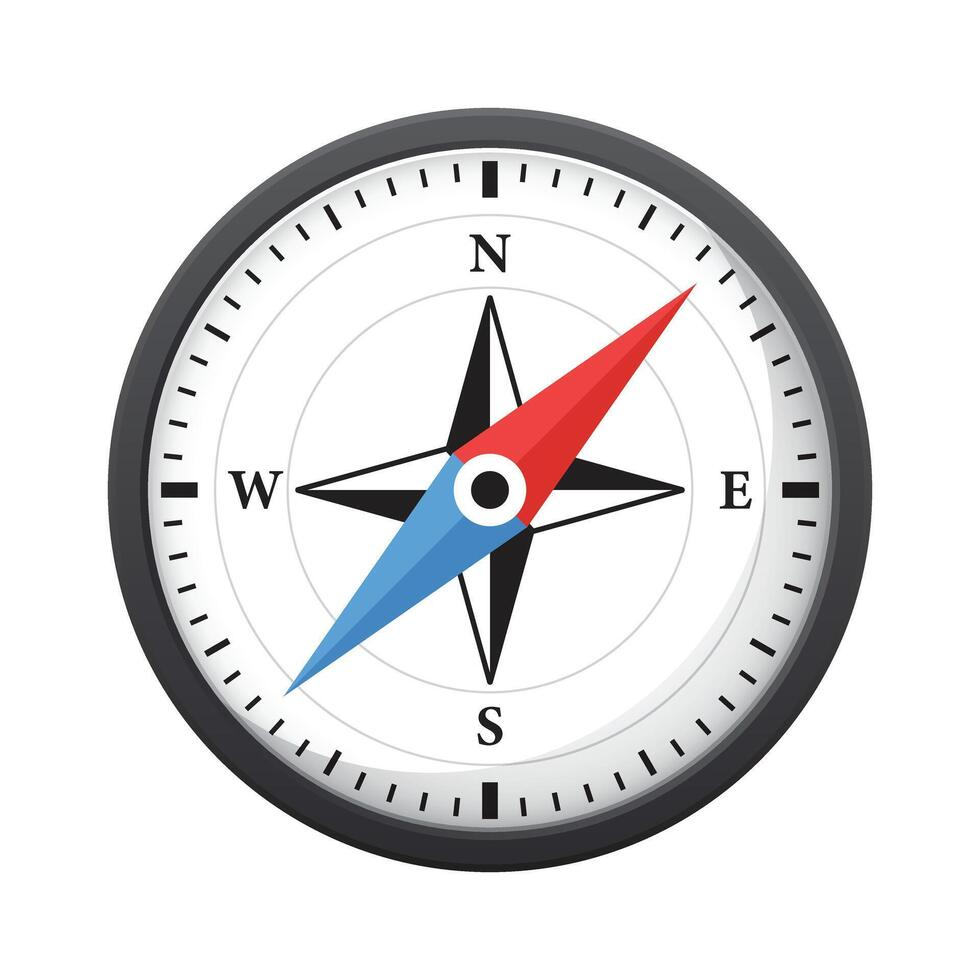
            
Создание 3-д моделей, легко и доступно

        

        

            <input type="text" class="search-input" id="searchInput" placeholder="Поиск по сайту...">
            <button class="search-btn" id="searchBtn">🔍</button>
            

        

    </header>

    <!-- ✅ ПЛАВАЮЩЕЕ ВИДЕО (десктоп) -->
    

        <video 
            src="piato4ki/vidos.speed-8x.mp4" 
            autoplay 
            muted 
            loop 
            playsinline
            controlslist="nodownload"
            preload="metadata"
            controls>
            Ваш браузер не поддерживает видео.
        </video>
        
Видео-инструкция: создание фиджет-игрушки (20 мин, ускорено 8×)

    

    <section class="hero-banner">
        

            <h1>пошаговая инструкция по 3-д компасу</h1>
            
Здесь мы подробно разберём программу КОМПАС-3D. Выберите тему, чтобы начать обучение:

            
            

                <a href="#install" class="nav-btn">Установка программы</a>
                <a href="#create" class="nav-btn">Создание 3D моделей</a>
                <a href="#print" class="nav-btn">Печать на принтере</a>
            

        

    </section>

    <!-- РАЗДЕЛ 1: Установка -->
    <section id="install" class="content-section">
        

            <h2>1. Установка программы</h2>
            
            
Если вы совсем недавно обзавелись 3D-принтером, но уже поняли, что распечатывать готовые чужие файлы вам скучно, значит, этот цикл публикаций создан специально для вас. В своих материалах я постараюсь помочь вам освоить создание авторских 3D-моделей.

            
            
<strong>КОМПАС-3D Home</strong> — это интуитивно понятная даже новичку платформа для трёхмерного проектирования, при этом обладающая функционалом, сопоставимым с профессиональными решениями.

            
            
Данный продукт разработан отечественной компанией <strong>АСКОН</strong> на базе профессионального пакета <strong>КОМПАС-3D</strong>, который успешно присутствует на рынке уже более четверти века.

            
            
Интерфейс и вся сопроводительная документация, включая руководства и справочные материалы, полностью переведены на русский язык, что, несомненно, облегчит процесс освоения программы.

            
Для начала работы вы можете загрузить бесплатную пробную версию <strong>КОМПАС-3D Home</strong>, рассчитанную на 60 дней использования. Сделать это можно на официальном ресурсе <strong>kompas.ru</strong>.

            
            
🔗 Прямая ссылка для загрузки: 
            <a href="http://kompas.ru/kompas-3d-home/download/" target="_blank" class="simple-link">http://kompas.ru/kompas-3d-home/download/</a>

            
            
Заполнив простую регистрационную форму, вы получите на указанный e-mail ссылку на архив с дистрибутивом. Скачайте файл, распакуйте его и запустите установку. Уверен, этот этап не вызовет у вас сложностей.

            
            
После активации вы увидите стартовый экран программы.

            
            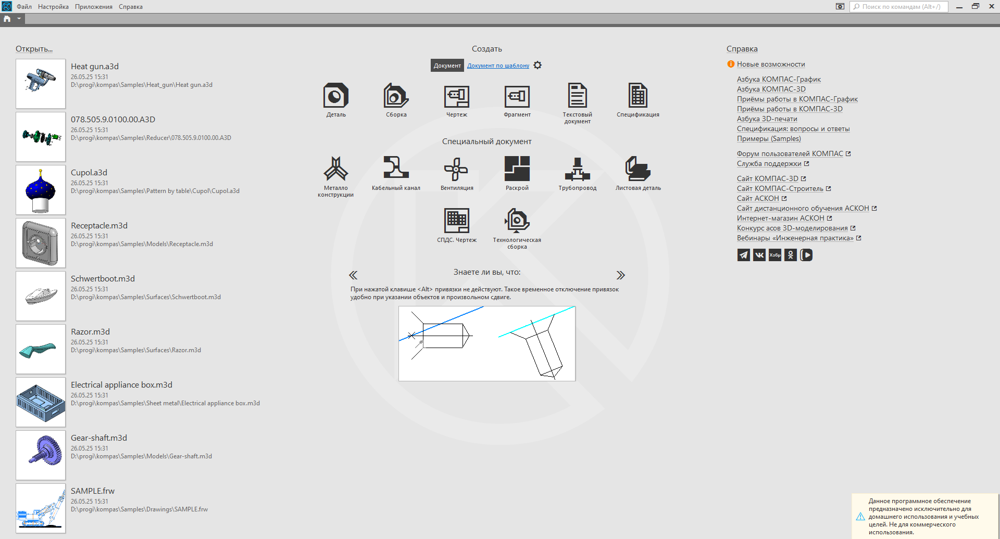
            
Фото 1: Стартовый экран КОМПАС-3D

            <h3>Создание детали</h3>
            
Для начала работы над новым объектом просто нажмите на иконку с надписью 'деталь' на стартовой странице.

            
            <h3>Эскиз — фундамент любой модели</h3>
            
Базой для любой операции служит эскиз. Чертежи размещаются на рабочих плоскостях или поверхностях существующей геометрии.

            
Чтобы начать построение, активируйте кнопку <strong>«Эскиз»</strong> на панели «Текущее состояние» и укажите нужную плоскость.

            
После этого программа переключится в режим редактирования эскиза: изображение ориентируется параллельно экрану, а в углу появится индикатор текущего режима.

            
            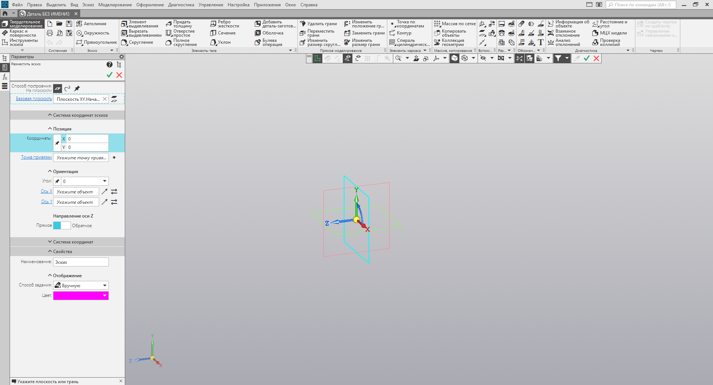
            
Фото 2: Интерфейс режима эскиза

            <h3>Рисуем прямоугольник</h3>
            
Выберите инструмент <strong>«Прямоугольник»</strong> на вкладке «Геометрия» или «Элементы тела».

            
            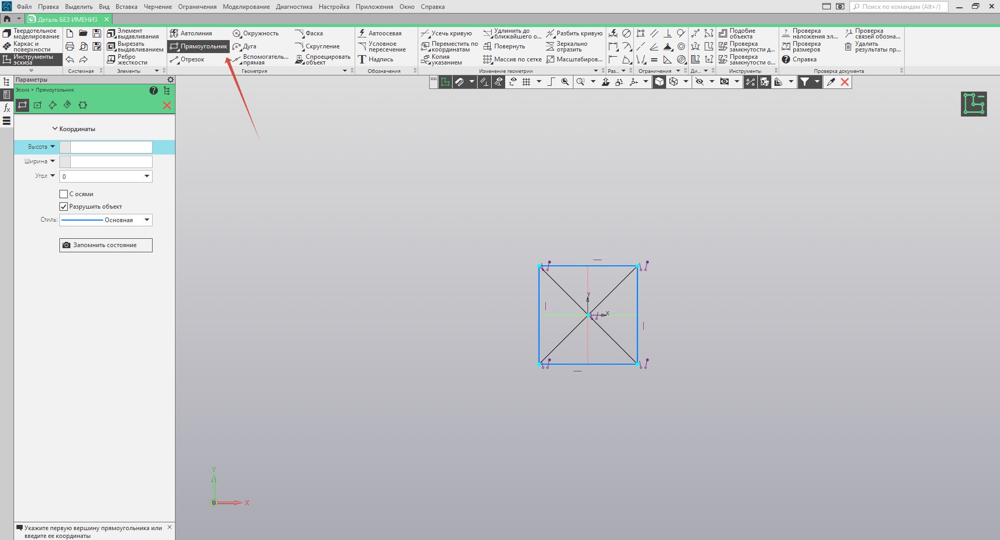
            
Фото 3: Выбор инструмента

            
            
Вы можете задать габариты двумя способами: кликнуть мышью в двух произвольных точках или ввести точные значения с клавиатуры. Наберите высоту <strong>50 мм</strong>, подтвердите ввод клавишей <strong>Enter</strong>, затем укажите ширину <strong>50 мм</strong> и снова нажмите <strong>Enter</strong>. Щёлкните в любом месте рабочей области, чтобы разместить фигуру.

            
            
Теперь можно завершить работу с эскизом. Для этого повторно нажмите кнопку <strong>«Эскиз»</strong> на панели состояния или воспользуйтесь значком выхода в правом верхнем углу.

            <h3>Операция выдавливания</h3>
            
Когда эскиз готов, можно приступить к созданию объёма. Активируйте команду <strong>«Элемент выдавливания»</strong> на панели «Элементы тела».

            
            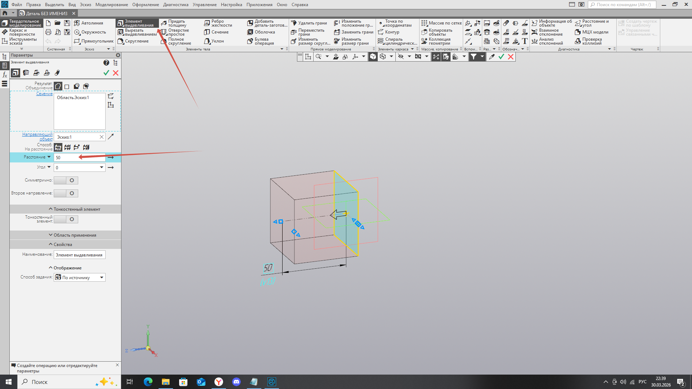
            
Фото 4: Команда выдавливания

            
            
Задайте глубину: перетащите маркеры в окне предпросмотра или введите значение <strong>50 мм</strong> вручную, подтвердив клавишей <strong>Enter</strong>. Для завершения операции нажмите <strong>«Создать объект»</strong> или используйте комбинацию <strong>Ctrl+Enter</strong>.

            
            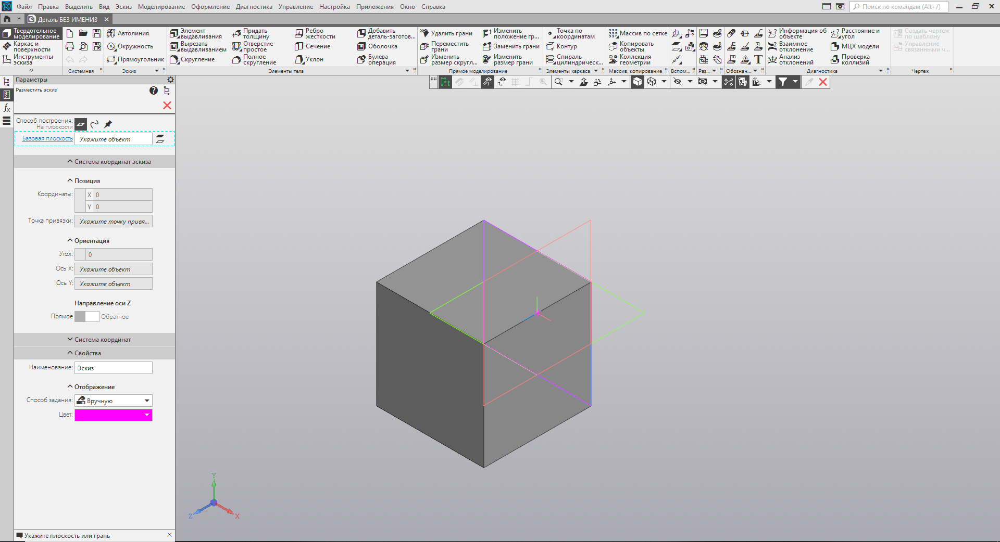
            
Фото 5: Результат выдавливания

            
            
В результате у вас появится куб (или параллелепипед — в зависимости от введённых параметров).

            <h3>Сохранение проекта</h3>
            
Не забудьте сохранить результат: нажмите кнопку <strong>«Сохранить»</strong> на стандартной панели или используйте горячие клавиши <strong>Ctrl+S</strong>. Укажите удобную папку для размещения файла.

            <h3>Экспорт для 3D-печати</h3>
            
Чтобы отправить модель на печать, её необходимо экспортировать в формат <strong>STL</strong>.

            
Для этого в меню <strong>«Файл»</strong> выберите пункт <strong>«Сохранить как...»</strong>. В диалоговом окне в списке «Тип файла» укажите формат <strong>Stl</strong>.

            
Затем кликните по стрелке рядом с кнопкой <strong>«Сохранить»</strong> и в выпадающем меню выберите <strong>«Сохранить с параметрами»</strong>.

            
Откроется окно «Параметры экспорта в Stl». В данном случае настройки можно оставить без изменений — просто подтвердите действие, нажав <strong>Ок</strong>.

            
            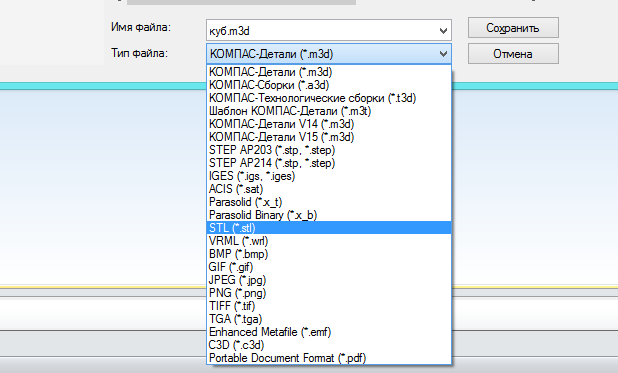
            
Фото 6: Окно параметров экспорта

            
            
В следующем диалоге выберите вариант <strong>«Текстовый»</strong> и нажмите кнопку <strong>«Начать запись»</strong>.

            
            

                🎉 Поздравляем! Ваша первая авторская модель, готовая к 3D-печати, создана!
            

        

    </section>

    <!-- РАЗДЕЛ 2: Создание моделей (с видео) -->
    <section id="create" class="content-section">
        

            <h2>2. Создание простых 3D моделей</h2>
            
            <!-- ✅ СТАТИЧНОЕ ВИДЕО В НАЧАЛЕ РАЗДЕЛА (для мобильных и начальной позиции) -->
            

                <video 
                    src="piato4ki/vidos.speed-8x.mp4" 
                    autoplay 
                    muted 
                    loop 
                    playsinline
                    controlslist="nodownload"
                    preload="metadata"
                    controls>
                    Ваш браузер не поддерживает видео.
                </video>
                
Видео-инструкция: создание фиджет-игрушки (20 мин, ускорено 8×)

            

            
            <h3>КОМПАС-3D для новичков: Создаём фиджет-игрушку с подвижной сферой</h3>
            
            <h4>Что будем делать</h4>
            
Создадим игрушку-антистресс из двух частей: <strong>корпус</strong> и <strong>подвижная сфера внутри</strong>. Для этого нам понадобятся три заготовки: корпус, сфера и спираль (для создания узора).

            
            

                <strong>Габариты модели:</strong> 
                • Высота: 70 мм 
                • Диаметр корпуса: 40 мм 
                • Диаметр спирали: 36 мм 
                • Диаметр сферы: 38 мм
            

            
            <h3>ШАГ 1: Подготовка</h3>
            <ol class="step-list">
                <li>Запустите <strong>КОМПАС-3D</strong></li>
                <li>Нажмите <strong>«Файл» → «Создать» → «Деталь»</strong></li>
                <li>Вы попали в рабочее пространство. Справа или слева вы видите <strong>Дерево построения</strong> — там будут появляться все ваши действия.</li>
            </ol>
            
            <h3>ШАГ 2: Создаём спираль (основу узора)</h3>
            
            <h4>2.1. Вызываем команду</h4>
            <ul>
                <li>Перейдите: <strong>«Моделирование» → «Элементы каркаса» → «Спираль цилиндрическая»</strong></li>
                <li>Совет: Если не нашли, введите «спираль» в поиске команд (значок лупы вверху)</li>
            </ul>
            
            <h4>2.2. Настраиваем спираль</h4>
            
В появившейся панели справа:

            
            <table class="param-table">
                <thead>
                    <tr>
                        <th>Параметр</th>
                        <th>Значение</th>
                        <th>Зачем</th>
                    </tr>
                </thead>
                <tbody>
                    <tr>
                        <td><strong>Базовая плоскость</strong></td>
                        <td>Выберите синюю плоскость</td>
                        <td>Где рисовать спираль</td>
                    </tr>
                    <tr>
                        <td><strong>Координаты</strong></td>
                        <td>X=0, Y=0</td>
                        <td>Чтобы спираль встала ровно в центр</td>
                    </tr>
                    <tr>
                        <td><strong>Диаметр</strong></td>
                        <td>36 мм</td>
                        <td>Чуть меньше корпуса</td>
                    </tr>
                    <tr>
                        <td><strong>Количество витков</strong></td>
                        <td>0.7–1.5</td>
                        <td>Меньше витков = меньше дефектов при печати</td>
                    </tr>
                    <tr>
                        <td><strong>Высота (шаг)</strong></td>
                        <td>70 мм</td>
                        <td>По высоте игрушки</td>
                    </tr>
                </tbody>
            </table>
            
            
Нажмите <strong>«Создать объект»</strong> (зелёная галочка) или <code>Ctrl+Enter</code>

            
            <h4>2.3. Рисуем «лепесток» спирали</h4>
            <ol class="step-list">
                <li>Нажмите кнопку <strong>«Эскиз»</strong> (значок карандаша)</li>
                <li>Кликните по <strong>синей плоскости</strong> — она повернётся к вам «лицом»</li>
                <li>В панели <strong>«Геометрия»</strong> выберите <strong>«Прямоугольник по центру и вершине»</strong></li>
                <li>Поставьте центр прямоугольника на <strong>горизонтальную ось</strong> (появится значок привязки)</li>
                <li>Вторую точку зафиксируйте на <strong>вертикальной оси</strong> — так лепесток будет симметричным</li>
            </ol>
            
            <h4>2.4. Добавляем окружность и размеры</h4>
            <ol class="step-list">
                <li>Выберите инструмент <strong>«Окружность»</strong> и поставьте её в центр прямоугольника</li>
                <li>Нажмите <strong>«Авторазмер»</strong> (в разделе «Черчение» → «Размеры»)</li>
                <li>Проставьте размеры:
                    <ul>
                        <li>Диаметр окружности: <strong>6 мм</strong></li>
                        <li>Расстояние от центра до края прямоугольника: <strong>15 мм</strong></li>
                        <li>Толщина прямоугольника: <strong>4 мм</strong></li>
                    </ul>
                </li>
            </ol>
            
            <h4>2.5. Копируем лепестки по кругу</h4>
            <ol class="step-list">
                <li>Зажмите <code>Shift</code> и выделите все контуры (прямоугольник + окружность)</li>
                <li>Выберите: <strong>«Черчение» → «Копия» → «Копия по окружности»</strong></li>
                <li>Настройки:
                    <ul>
                        <li><strong>Центр копирования</strong>: начало координат (0;0)</li>
                        <li><strong>Режим</strong>: «Заданное количество на окружности»</li>
                        <li><strong>Количество</strong>: 5 или 7 (нечётное число)</li>
                    </ul>
                </li>
            </ol>
            
            

                <strong>Важно:</strong> При чётном числе контуры пересекаются в одной точке — КОМПАС не сможет сделать их объёмными.
            

            
            <ol class="step-list" start="4">
                <li>Нажмите «Создать объект» — эскиз готов</li>
            </ol>
            
            <h4>2.6. Делаем спираль объёмной</h4>
            <ol class="step-list">
                <li>Выберите: <strong>«Моделирование» → «Добавить элемент» → «Элемент по траектории»</strong></li>
                <li>В панели настроек:
                    <ul>
                        <li><strong>Сечение</strong>: ваш эскиз с лепестками (выбрано автоматически)</li>
                        <li><strong>Траектория</strong>: кликните по спирали, которую создали в шаге 2.2</li>
                    </ul>
                </li>
                <li>Нажмите «Создать объект» — спираль готова.</li>
            </ol>
            
            
<strong>Скройте лишнее</strong>: в Дереве построения нажмите на значок видимости (глаз) рядом со спиралью и эскизом — они исчезнут из вида, но останутся в файле.

            
            <!-- ✅ ФОТО 9 -->
            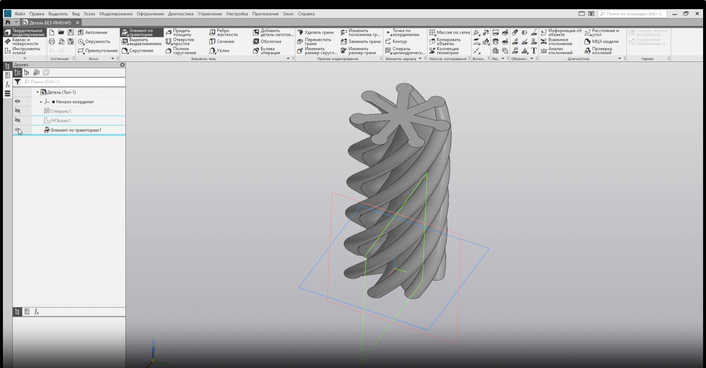
            
Фото 9: Готовая спираль

            
            <h3>ШАГ 3: Создаём корпус</h3>
            
            <h4>3.1. Новый эскиз</h4>
            <ol class="step-list">
                <li>Убедитесь, что спираль скрыта</li>
                <li>Нажмите <strong>«Эскиз»</strong> → выберите <strong>зелёную плоскость</strong></li>
            </ol>
            
            <h4>3.2. Рисуем контур корпуса</h4>
            
Нарисуйте половину профиля корпуса (как на разрезе):

            <ol class="step-list">
                <li><strong>«Отрезок»</strong>: вертикальная линия внизу</li>
                <li><strong>«Дуга по двум точкам»</strong>: плавный изгиб корпуса</li>
                <li><strong>«Отрезок»</strong>: верхняя граница</li>
            </ol>
            
            <h4>3.3. Добавляем ограничения и размеры</h4>
            <table class="param-table">
                <thead>
                    <tr>
                        <th>Действие</th>
                        <th>Инструмент</th>
                        <th>Значение</th>
                    </tr>
                </thead>
                <tbody>
                    <tr>
                        <td>Сделать отрезки равными</td>
                        <td>«Ограничения» → «Равенство»</td>
                        <td>—</td>
                    </tr>
                    <tr>
                        <td>Задать высоту корпуса</td>
                        <td>«Авторазмер»</td>
                        <td>70 мм</td>
                    </tr>
                    <tr>
                        <td>Задать толщину стенки</td>
                        <td>«Авторазмер»</td>
                        <td>7 мм</td>
                    </tr>
                    <tr>
                        <td>Отступ дуги от центра</td>
                        <td>«Авторазмер» (горизонтальный)</td>
                        <td>10 мм</td>
                    </tr>
                    <tr>
                        <td>Радиус корпуса</td>
                        <td>«Авторазмер» (радиус)</td>
                        <td>20 мм (диаметр 40 мм)</td>
                    </tr>
                    <tr>
                        <td>Выровнять отрезки</td>
                        <td>«Ограничения» → «Выравнивание»</td>
                        <td>—</td>
                    </tr>
                </tbody>
            </table>
            
            <h4>3.4. Осевая линия для вращения</h4>
            <ol class="step-list">
                <li>Выберите: <strong>«Черчение» → «Автоосевая»</strong></li>
                <li>Проведите вертикальную линию через начало координат (зажмите <code>Shift</code> для строгой вертикали)</li>
            </ol>
            
            <h4>3.5. Создаём объём</h4>
            <ol class="step-list">
                <li>Выберите: <strong>«Моделирование» → «Добавить элемент» → «Элемент вращения»</strong></li>
                <li>Убедитесь, что спираль скрыта (иначе тела «склеятся»)</li>
                <li>Нажмите «Создать объект» — корпус готов</li>
            </ol>
            
            
Скройте корпус в Дереве построения, чтобы он не мешал.

            
            <!-- ✅ ФОТО 10 -->
            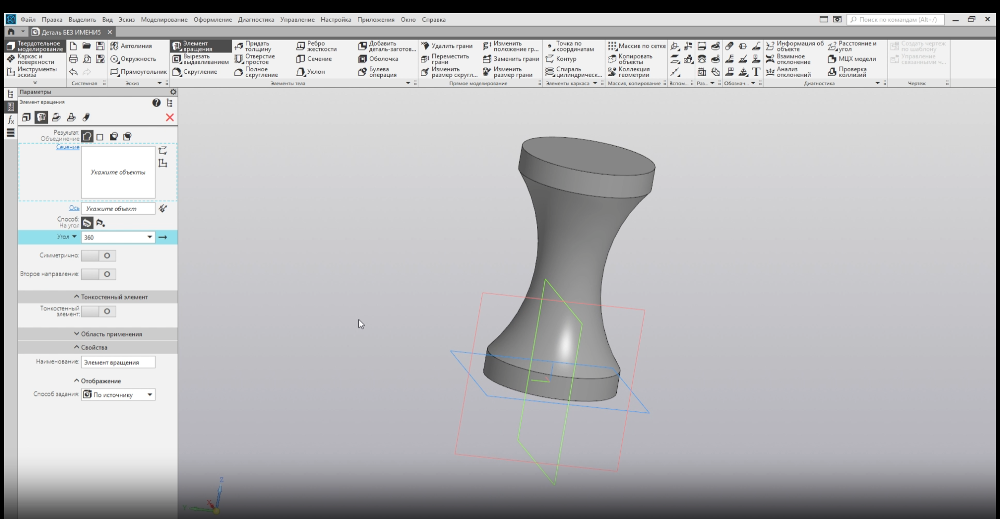
            
Фото 10: Готовый корпус

            
            <h3>ШАГ 4: Создаём сферу (подвижная часть)</h3>
            
            <h4>4.1. Новый эскиз</h4>
            <ol class="step-list">
                <li>Нажмите <strong>«Эскиз»</strong> → выберите <strong>зелёную плоскость</strong></li>
            </ol>
            
            <h4>4.2. Рисуем полуокружность</h4>
            <ol class="step-list">
                <li>Выберите <strong>«Дуга»</strong> (базовый инструмент)</li>
                <li>Поставьте центр дуги на вертикальную ось</li>
                <li>Начало и конец дуги тоже привяжите к вертикали</li>
                <li>Углы: начальный <strong>90°</strong>, конечный <strong>270°</strong></li>
            </ol>
            
            <h4>4.3. Размеры</h4>
            <ul>
                <li>Радиус дуги: <strong>19 мм</strong> (диаметр сферы = 38 мм)</li>
                <li>Отступ центра сферы от низа: <strong>35 мм</strong> (середина высоты 70 мм)</li>
            </ul>
            
            <h4>4.4. Делаем шар</h4>
            <ol class="step-list">
                <li>Добавьте осевую линию (как в шаге 3.4)</li>
                <li>Выберите <strong>«Элемент вращения»</strong> → нажмите «Создать объект»</li>
            </ol>
            
            
В Дереве построения у вас теперь три тела: <strong>Спираль</strong>, <strong>Корпус</strong>, <strong>Сфера</strong>

            
            <!-- ✅ ФОТО 11 -->
            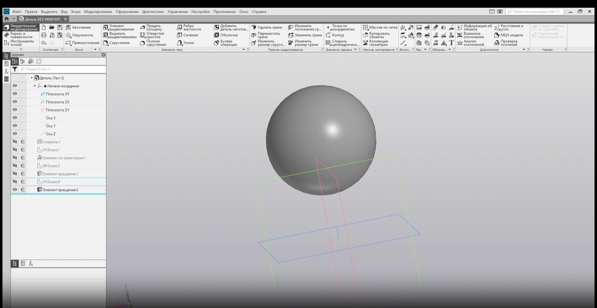
            
Фото 11: Готовая сфера

            
            <h3>ШАГ 5: Булевы операции</h3>
            
            

                <strong>Совет:</strong> Переключите вид Дерева с «Истории построения» на <strong>«Структурное представление»</strong>. Так вы увидите именно тела, а не шаги их создания.
            

            
            <h4>5.1. Вырезаем узор на корпусе</h4>
            <ol class="step-list">
                <li>Скройте сферу и вторую спираль (оставьте видны только <strong>Корпус</strong> и <strong>Спираль-1</strong>)</li>
                <li>Выберите: <strong>«Моделирование» → «Булевы операции» → «Вычитание»</strong></li>
                <li>Настройки:
                    <ul>
                        <li><strong>Главное тело</strong>: Корпус (кликните по нему)</li>
                        <li><strong>Вычитаемое тело</strong>: Спираль-1</li>
                    </ul>
                </li>
                <li>Нажмите «Создать объект» — в корпусе появился спиральный узор.</li>
            </ol>
            
            <h4>5.2. Делаем подвижную сферу</h4>
            <ol class="step-list">
                <li>Скройте корпус, покажите <strong>Сферу</strong> и <strong>Спираль-2</strong> (копию спирали)</li>
                <li>Выберите: <strong>«Булевы операции» → «Пересечение»</strong></li>
                <li>Выделите сферу и спираль (порядок не важен)</li>
                <li>Нажмите «Создать объект» — сфера теперь со спиральным узором.</li>
            </ol>
            
            <!-- ✅ ФОТО 12 -->
            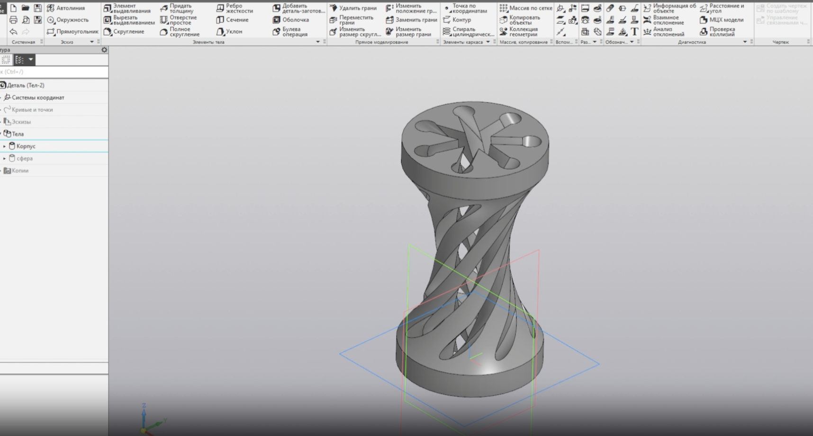
            
Фото 12: Результат булевых операций

            
            <h3>ШАГ 6: Добавляем зазор (чтобы сфера двигалась)</h3>
            
            

                <strong>Важно:</strong> Без этого шага сфера застрянет в корпусе.
            

            
            <ol class="step-list">
                <li>Скройте сферу, оставьте видимым только <strong>Корпус</strong></li>
                <li>Выберите: <strong>«Моделирование» → «Грани» → «Сместить грани»</strong></li>
                <li>Выделите <strong>внутренние грани корпуса</strong>, которые касаются сферы (удерживайте <code>Ctrl</code> для множественного выбора)</li>
                <li>В панели настроек:
                    <ul>
                        <li>Нажмите <strong>«Сменить направление»</strong>, чтобы отступ шёл внутрь</li>
                        <li>Значение смещения: <strong>0.3 мм</strong> (оптимальный зазор для 3D-печати)</li>
                    </ul>
                </li>
                <li>Нажмите «Создать объект»</li>
            </ol>
            
            
Покажите сферу — теперь между деталями есть небольшой промежуток.

            
            <h3>ШАГ 7: Сохраняем в STL для печати</h3>
            
            <h4>7.1. Сохраняем корпус</h4>
            <ol class="step-list">
                <li>Скройте сферу, оставьте видимым только <strong>Корпус</strong></li>
                <li><strong>«Файл» → «Сохранить как...»</strong></li>
                <li>Тип файла: <strong>«Файлы стереолитографии (*.stl)»</strong></li>
                <li>Нажмите на <strong>стрелочку рядом с кнопкой «Сохранить»</strong> → <strong>«Сохранить с параметрами»</strong></li>
                <li>В окне настроек:
                    <ul>
                        <li><strong>Точность (допуск)</strong>: <strong>0.01 мм</strong> (для гладких поверхностей)</li>
                        <li>Формат: <strong>Двоичный</strong> (меньше размер файла)</li>
                    </ul>
                </li>
                <li>Нажмите <strong>«Экспортировать»</strong></li>
            </ol>
            
            <h4>7.2. Сохраняем сферу</h4>
            <ol class="step-list">
                <li>Скройте корпус, покажите <strong>Сферу</strong></li>
                <li>Повторите шаги 2–6 выше</li>
                <li>Готово. У вас два STL-файла: <code>корпус.stl</code> и <code>сфера.stl</code></li>
            </ol>
            
            

                <strong>Готово. Что дальше?</strong>  
                1. Загрузите STL-файлы в слайсер (Cura, PrusaSlicer и др.) 
                2. Настройте печать (материал: PLA, высота слоя: 0.15–0.2 мм) 
                3. Распечатайте обе детали 
                4. Соберите: сфера должна свободно вращаться внутри корпуса  
                <em>Важно: Всегда сохраняйте исходный файл .m3d — в нём можно редактировать модель. STL-файл предназначен только для печати.</em>
            

        

    </section>

    <!-- РАЗДЕЛ 3: Печать -->
    <section id="print" class="content-section">
        

            <h2>3. Печать на 3D принтере</h2>
            
            <h3>ЭТАП 1: Поиск и загрузка 3D-моделей</h3>
            
            <h4>Вариант А: Скачивание готовых STL-моделей</h4>
            
Посетите библиотеки 3D-моделей:

            <ul>
                <li><a href="https://www.thingiverse.com" target="_blank" class="simple-link">Thingiverse</a></li>
                <li><a href="https://www.printables.com" target="_blank" class="simple-link">Printables</a></li>
                <li><a href="https://cults3d.com" target="_blank" class="simple-link">Cults3D</a></li>
            </ul>
            
В поиске введите название модели (например, «fidget cube», «gear», «bracket»)

            
Выберите модель с высоким рейтингом и положительными отзывами

            
Нажмите кнопку Download → скачайте файл в формате .STL

            
            <h4>Вариант Б: Создание собственной модели в КОМПАС-3D</h4>
            <ul class="step-list">
                <li>На стартовой странице нажмите «Создать деталь»</li>
                <li>Постройте эскиз на одной из плоскостей (кнопка «Эскиз» → выбор плоскости)</li>
                <li>Используйте инструменты геометрии: «Прямоугольник», «Окружность», «Отрезок»</li>
                <li>Примените операцию «Выдавливание» для создания объёма</li>
                <li>Добавьте дополнительные элементы: «Вырезать», «Скругление», «Массив»</li>
                <li>Сохраните модель: Файл → Сохранить (формат .m3d — родной формат КОМПАС)</li>
            </ul>
            
            <h3>ЭТАП 2: Импорт модели в КОМПАС-3D (если модель скачана)</h3>
            
            

                <strong>Важно:</strong> КОМПАС-3D — это САПР для проектирования, а не слайсер. Он используется для подготовки и экспорта модели, а не для непосредственной печати.
            

            
            <h4>Шаг 2.1: Открытие STL-файла</h4>
            <ul class="step-list">
                <li>Запустите КОМПАС-3D</li>
                <li>Перейдите: Файл → Открыть</li>
                <li>В типе файлов выберите «Файлы стереолитографии (*.stl)»</li>
                <li>Найдите скачанный файл и откройте его</li>
            </ul>
            
            <h4>Шаг 2.2: Проверка и редактирование модели</h4>
            
Убедитесь, что модель загрузилась корректно

            
При необходимости:

            <ul>
                <li>Масштабируйте: Инструменты → Редактирование детали → Масштабирование</li>
                <li>Ориентируйте: Вид → Ориентация → выберите нужный ракурс</li>
                <li>Проверьте геометрию: Сервис → Проверка модели (на наличие разрывов)</li>
            </ul>
            
            <h3>ЭТАП 3: Экспорт модели в STL для 3D-печати</h3>
            
<strong>Это критически важный этап — от настроек экспорта зависит качество печати.</strong>

            
            <h4>Шаг 3.1: Вызов команды экспорта</h4>
            <ul class="step-list">
                <li>Убедитесь, что открыта деталь (не сборка и не чертёж)</li>
                <li>Перейдите: Файл → Сохранить как...</li>
                <li>В поле «Тип файла» выберите «Файлы стереолитографии (*.stl)»</li>
            </ul>
            
            <h4>Шаг 3.2: Настройка параметров экспорта</h4>
            
Нажмите на стрелку ▼ рядом с кнопкой «Сохранить»

            
Выберите «Сохранить с параметрами»

            
Откроется окно «Параметры экспорта в STL»:

            
            <table class="param-table">
                <thead>
                    <tr>
                        <th>Параметр</th>
                        <th>Рекомендуемое значение</th>
                        <th>Пояснение</th>
                    </tr>
                </thead>
                <tbody>
                    <tr>
                        <td>Формат файла</td>
                        <td>Текстовый (ASCII) или Двоичный</td>
                        <td>Двоичный — меньше размер, Текстовый — легче редактировать</td>
                    </tr>
                    <tr>
                        <td>Единицы измерения</td>
                        <td>Миллиметры (мм)</td>
                        <td>Стандарт для 3D-печати</td>
                    </tr>
                    <tr>
                        <td>Точность (допуск)</td>
                        <td>0.01–0.05 мм</td>
                        <td>Чем меньше — тем выше детализация, но больше размер файла</td>
                    </tr>
                    <tr>
                        <td>Разбиение на треугольники</td>
                        <td>Автоматически / Высокое качество</td>
                        <td>Обеспечивает плавные поверхности</td>
                    </tr>
                    <tr>
                        <td>Экспортировать</td>
                        <td>Только видимые компоненты / Вся деталь</td>
                        <td>Выбирайте в зависимости от задачи</td>
                    </tr>
                </tbody>
            </table>
            
            
Нажмите ОК для подтверждения

            
            <h4>Шаг 3.3: Сохранение файла</h4>
            <ul class="step-list">
                <li>Укажите папку для сохранения (рекомендуется создать отдельную папку STL_Export)</li>
                <li>Дайте файлу понятное имя (например, MyPart_v1.stl)</li>
                <li>Нажмите Сохранить</li>
            </ul>
            
            <h3>ЭТАП 4: Подготовка к печати в слайсере</h3>
            
            

                <strong>Важно:</strong> КОМПАС-3D не управляет принтером напрямую. Для печати необходим слайсер — программа, преобразующая STL в G-код (инструкции для принтера).
            

            
            
<strong>Популярные слайсеры:</strong>

            <ul>
                <li>Cura (бесплатный, самый популярный)</li>
                <li>PrusaSlicer (открытый, много настроек)</li>
                <li>Simplify3D (платный, профессиональный)</li>
            </ul>
            
            <h4>Шаг 4.1: Импорт STL в слайсер</h4>
            <ul class="step-list">
                <li>Запустите слайсер (например, Cura)</li>
                <li>Перетащите файл .stl в рабочую область или используйте Файл → Открыть</li>
                <li>Модель появится на виртуальном столе</li>
            </ul>
            
            <!-- ✅ НОВОЕ ФОТО 7 (PNG) -->
            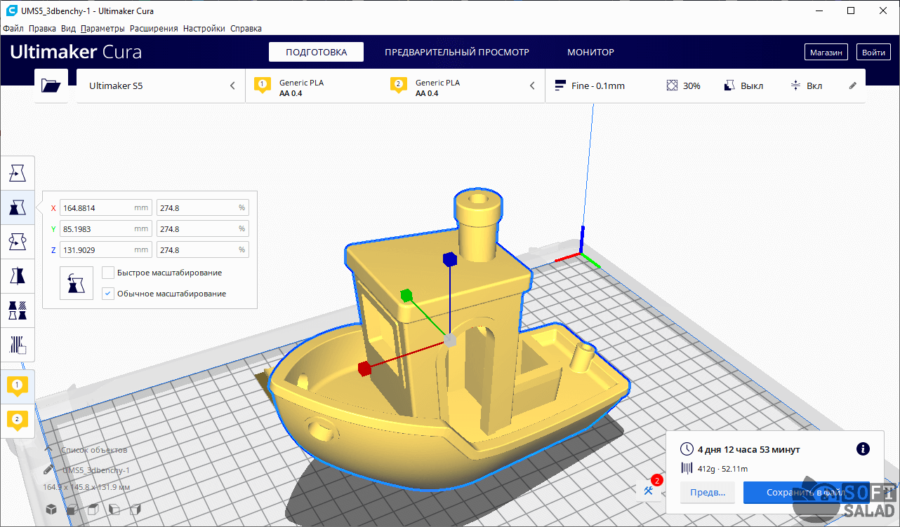
            
Фото 7: Модель на виртуальном столе в слайсере

            
            <h4>Шаг 4.2: Настройка параметров печати</h4>
            
Основные параметры (пример для PLA-пластика):

            
            <table class="param-table">
                <thead>
                    <tr>
                        <th>Параметр</th>
                        <th>Значение</th>
                        <th>Комментарий</th>
                    </tr>
                </thead>
                <tbody>
                    <tr>
                        <td>Высота слоя</td>
                        <td>0.15–0.2 мм</td>
                        <td>Баланс качества и скорости</td>
                    </tr>
                    <tr>
                        <td>Заполнение (Infill)</td>
                        <td>15–25%</td>
                        <td>Для декоративных деталей; 50–100% — для прочных</td>
                    </tr>
                    <tr>
                        <td>Толщина стенок</td>
                        <td>1.2–1.6 мм (3–4 периметра)</td>
                        <td>Обеспечивает прочность</td>
                    </tr>
                    <tr>
                        <td>Скорость печати</td>
                        <td>40–60 мм/с</td>
                        <td>Медленнее = качественнее</td>
                    </tr>
                    <tr>
                        <td>Температура сопла</td>
                        <td>200–210 °C (для PLA)</td>
                        <td>Зависит от производителя пластика</td>
                    </tr>
                    <tr>
                        <td>Температура стола</td>
                        <td>50–60 °C (для PLA)</td>
                        <td>Улучшает адгезию</td>
                    </tr>
                    <tr>
                        <td>Поддержки (Supports)</td>
                        <td>Вкл., если есть свесы >45°</td>
                        <td>Тип: Tree (древовидные) — экономнее</td>
                    </tr>
                    <tr>
                        <td>Адгезия к столу</td>
                        <td>Brim или Skirt</td>
                        <td>Предотвращает отрыв модели</td>
                    </tr>
                </tbody>
            </table>
            
            <h4>Шаг 4.3: Слайсинг и сохранение G-кода</h4>
            <ul class="step-list">
                <li>Нажмите кнопку «Slice» (Нарезать)</li>
                <li>Дождитесь расчёта траекторий</li>
                <li>Просмотрите предпросмотр: убедитесь, что все слои корректны</li>
                <li>Нажмите «Save to File» и сохраните файл с расширением .gcode</li>
            </ul>
            
            <h3>ЭТАП 5: Печать на 3D-принтере</h3>
            
            <h4>Шаг 5.1: Подготовка принтера</h4>
            <ul class="step-list">
                <li>Включите принтер и дождитесь нагрева</li>
                <li>Очистите печатную платформу (протрите изопропиловым спиртом)</li>
                <li>Загрузите пластик: подайте нить в экструдер до появления капли из сопла</li>
                <li>Откалибруйте стол (если требуется): зазор между соплом и столом ≈ толщина листа бумаги</li>
            </ul>
            
            <!-- ✅ НОВОЕ ФОТО 8 -->
            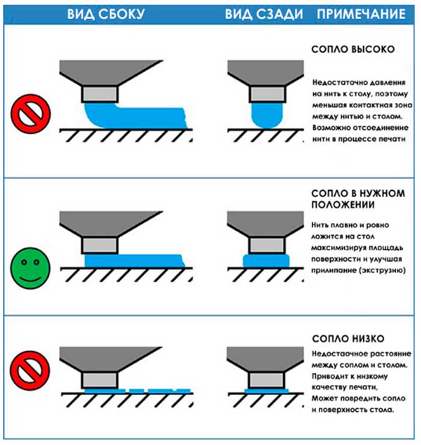
            
Фото 8: Калибровка печатного стола

            
            <h4>Шаг 5.2: Запуск печати</h4>
            
<strong>Способ А: Через SD-карту</strong>

            <ul>
                <li>Скопируйте .gcode-файл на microSD-карту</li>
                <li>Вставьте карту в принтер</li>
                <li>В меню принтера выберите Print from SD → ваш файл → Start</li>
            </ul>
            
            
<strong>Способ Б: Через USB / Wi-Fi</strong>

            <ul>
                <li>Подключите принтер к компьютеру кабелем или по сети</li>
                <li>В слайсере нажмите «Print via USB» (если поддерживается)</li>
                <li>Следите за началом печати через интерфейс принтера</li>
            </ul>
            
            <h4>Шаг 5.3: Контроль процесса</h4>
            <ul class="step-list">
                <li>Первые 5–10 минут наблюдайте за печатью: убедитесь, что первый слой ложится ровно</li>
                <li>Не открывайте дверцу (если принтер с камерой) — перепады температуры могут вызвать отслоение</li>
                <li>При необходимости используйте вентилятор для обдува (для PLA)</li>
            </ul>
            
            <h4>Шаг 5.4: Завершение и постобработка</h4>
            <ul class="step-list">
                <li>После окончания печати дождитесь остывания стола (особенно для ABS)</li>
                <li>Аккуратно снимите модель шпателем</li>
                <li>Удалите поддержки (кусачками, ножом)</li>
                <li>При необходимости:
                    <ul>
                        <li>Обработайте наждачной бумагой (зерно 200–800)</li>
                        <li>Покрасьте или покройте грунтовкой</li>
                        <li>Склейте детали (если модель печаталась частями)</li>
                    </ul>
                </li>
            </ul>
            
            

                Готово! Ваша модель успешно напечатана.
            

        

    </section>

    <!-- === ИСТОЧНИКИ ИНФОРМАЦИИ === -->
    <section class="sources-section">
        

            <h2>📚 Источники информации:</h2>
            <ul class="sources-list">
                <li><a href="https://rutube.ru/video/07606f6dcfdfc78d1bc17864afdcaca4/?r=wd" target="_blank">https://rutube.ru/video/07606f6dcfdfc78d1bc17864afdcaca4/?r=wd</a></li>
                <li><a href="https://www.ixbt.com/live/sw/kak-sozdat-prostye-figury-v-kompas-3d-kvadrat-treugolnik-krug.html#toc_header1" target="_blank">https://www.ixbt.com/live/sw/kak-sozdat-prostye-figury-v-kompas-3d-kvadrat-treugolnik-krug.html</a></li>
                <li><a href="https://fluidcourse.ru/kompasmetodichka#module-2-exercise-5" target="_blank">https://fluidcourse.ru/kompasmetodichka#module-2-exercise-5</a></li>
                <li><a href="https://pikabu.ru/story/3d_pechat_dlya_chaynikov_chast_1_vvodnaya_10272914" target="_blank">https://pikabu.ru/story/3d_pechat_dlya_chaynikov_chast_1_vvodnaya_10272914</a></li>
            </ul>
        

    </section>

    <footer>
        
&copy; 2023 Обучение 3D Компас. Все права защищены.

    </footer>

    <!-- ✅ СКРИПТ ДЛЯ «УМНОГО» ПЛАВАЮЩЕГО ВИДЕО И ПОИСКА -->
    

</body>
</html>
